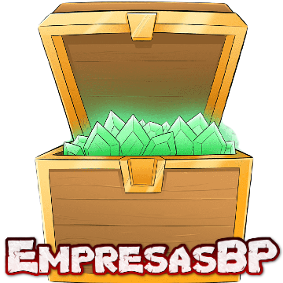

# ChestRandomBP

ChestRandomBP: This plugin generates chests, it works [PocketMine-MP](https://github.com/pmmp/PocketMine-MP) and random places within a specific world. Where you can customize what each one of them contains, the time and the world of spawning.

## :sparkles: Commands?

The plugin does not contain commands, everything is generated from the modification of the [plugin data](https://github.com/ByPaps/ChestRandomBP/tree/main/resources)

## 📁 Supported software:

**This plugin works only on PocketMine-MP.**

## 🔧 How to install ChestRandomBP?

1) [Download]() latest stable released version from poggit
2) Move dowloaded file to your server **/plugins/** folder
3) Restart the server

## 👍 Support / Contact:

</a>

<a href="https://discord.gg/zmkbsVtskH">
  
